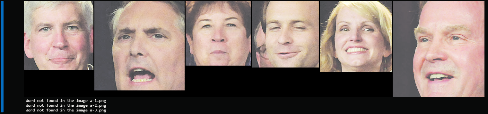

# OpenCV/Tesseract Project

This is a project part of the Coursera Python 3 Programming Specialization . This project uses openCV, pytesseract and pillow libraries to take a zip file containing images. The program then takes those images, extracting the text contained by those images using the pytesseract library. We then give the program a word as an input, the program searches through the images to check if any word inside those images is the same as the one given by the user. If the case checks as true, we crop the faces of the people in the image creating a contact sheet with all the faces. If the case checks out as false, we give the user a print telling that there is no mathc for the word given inside the image.

Down below there's an example of an output. Where we feed the program 4 images (a-0.png, a-1.png, a-2.png and a-3.png) and we check if the word "precincts" is in the text of those images. In this case, only the first image (a-0.png) has the word precincts in the text, so we return the faces of the people in the image. As for the other images, we check that the word "precincts" is not in the text so we print the information:

